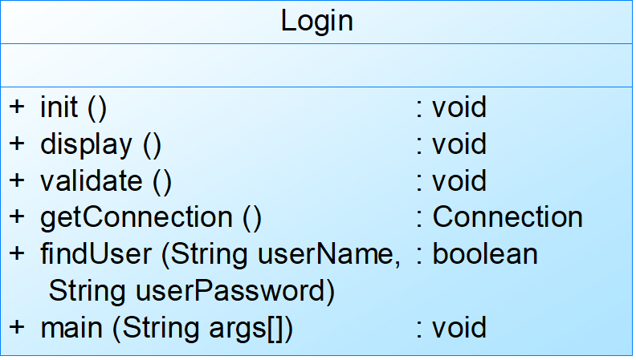

# Some problems

## 1. 软件测试过程，结合项目实践

答：
软件的测试过程包括单元测试、集成测试、功能测试、性能测试、验收测试、安装测试。

单元测试是对软件最小可测试单元（通常是单个函数或模块）的验证。我们采用了静态测试和动态测试结合的方法：  

- **静态测试**：通过代码审查，多名队员共同阅读和评审代码，确保其逻辑正确、没有明显的缺陷。
- **动态测试**：通过白盒测试方法，分析程序内部结构，确保测试覆盖所有可能的分支和路径。例如，在员工注册功能中，测试不同性别的注册情况，确保所有逻辑分支均被覆盖。此外，还测试了各种边界条件，如密码长度限制（6~16位数字和字母组合），测试了超出或不足该长度的情况，以验证系统的异常处理能力, 这属于黑盒测试法。

集成测试旨在发现模块之间交互时可能存在的问题。我们采用了增量式集成测试策略： 

- **增量式集成测试**：逐步将未集成的模块与已集成的模块结合，边集成边测试。例如，首先测试用户注册模块，在确认无误后，再集成并测试用户信息查询模块，然后是信息修改模块，最后测试基于不同条件的用户信息筛选和打印模块。这样逐步集成和测试，有助于及早发现并解决问题。

功能测试是对整个系统的功能进行验证，确保系统按照需求规格说明书中描述的功能正常运行： 

- 我们模拟一个新用户的使用场景，按照实际使用顺序进行各个功能模块的测试：从用户注册、信息查询、信息修改、密码修改及身份验证，到奖金和工资查询等，逐步进行全面的功能验证，确保所有功能模块都能正常运作。

性能测试旨在验证系统在实际工作环境中的性能表现，确保系统能够在预期的工作负载下稳定运行： 

- 我们模拟了客户的实际工作环境，对系统进行了压力测试和负载测试，以确认系统在高负载情况下的稳定性和响应速度，确保系统在实际使用中不会出现性能瓶颈或崩溃情况。
  
验收测试是与客户共同进行的测试，目的是确保系统满足客户的所有预期和需求： 

- 我们与使用的客户详细交流，按照客户提出的使用场景和功能需求进行测试，确认系统的功能和性能均符合客户的期望。客户确认测试结果后，验收测试顺利完成。

安装测试是在实际运行环境中进行的测试，目的是确保系统在客户的实际使用环境中能够正常安装和运行： 

- 我们给出人事管理系统的安装环境以及软件运行需求，将系统安装在客户的实际工作环境中，验证安装过程是否顺利，系统能否正常运行，确保所有功能和性能在实际环境中无缝衔接。

## 2. 故障播种，软件中的可信度

### 播散模型：

Mills 模型：人工随机置入错误 M 个错误，测试得出 m 个人工置入的错误，n 个程序固有的错误，则估算系统固有错误为： 
$$
N=\frac{n\times M}{m}
$$
Hyman 模型：两人同时进行测试，A 发现 n 个错误，B 发现 m 个错误，其中共同错误有 q 个，则估算系统的固有错误为： 
$$
N=\frac{m\times n}{q}
$$

## 3. 体系结构和设计原则两方面，提高软件质量所做的重构工作

体系结构：

(1) 管道-过滤风格：

优点：

1. 设计者可以将整个系统的输出、输出特性简单理解为各个过滤器功能的合成
2. 具有较强的可维护性和可扩展性
3. 具有并发性
4. 支持吞吐量计算、死锁检测等特定分析

缺点：

1. 交互式处理能力弱
2. 实现比较复杂

(2) 层次结构风格：

优点：

1. 支持系统设计过程中的逐级抽象
2. 具有较好的可维护性和可扩展性
3. 支持软件复用

缺点：

1. 并不是每个系统都可以很容易地划分为分层的模式
2. 很难找到一个合适的、正确的层次抽象方法

(3) C/S风格：

优点：

1. 界面和操作可以很丰富
2. 安全性高
3. 相应速度快

缺点：

1. 适用面窄
2. 用户群固定
3. 维护成本高

(4) B/S风格：

优点：

1. 维护和升级方式简单
2. 交互性较强

缺点：

1. 在速度和安全性上需要花费巨大的设计成本
2. 通常需要刷新页面
3. 通信开销大

## 4. 敏捷开发过程模型，自己的小组项目实践采用了哪种过程模型，为什么采用？

## 5. 主程序员组和民主制程序员组，项目实践中的组织管理方式，自己的角色工作

## 6. 需求建模过程，结合项目实践画图

## 7. 里氏代换和开闭原则解释，选一个画图分析

(1) 单一职责原则：一个类只负责一个功能领域中的相应职责

一个类只负责一个功能领域中的相应职责: 比如在我们的人事管理系统中，我们将登录界面的可视化与用户信息的确认想分开，使得他们只负责自己部分。

(2) 开闭原则： 一个软件实体应当对扩展开放，对修改关闭（抽象是其关键性， 灵活性和可扩展性）

比如在我们的人事管理系统中，我们设置了抽象登录界面类，用户登录界面和管理员登录界面等根据不同的需要来实例化这个类。

(3) 里氏代换原则： 所有引用基类（父类）的地方必须能透明地使用其子类的对象

比如在我们的人事管理系统中，对用户输入密码后进行加密然后存到数据库当中；我们有一个父类作为通用的加密格式，然后子类实现不同的加密算法，在具体对信息加密事，调用所需要的子类加密类。

(4) 依赖倒转原则： 高层模块不应该依赖低层模块，它们都应该依赖抽象。抽象不应该依赖于细节，细节应该依赖于抽象（要针对接口编程，不要针对实现编程）

比如在我们的人事管理系统中，对可能得输入格式，比如文本txt类，数据表xls类等进行转换，首先我们构建一个抽象源和抽象转换，然后用不同的类来实例化他们。

(5) 合成复用原则：尽量使用对象组合，而不是继承来达到复用的目的。

(6) 迪米特法则：又称为最少知识原则，一个软件实体应当尽可能少的与其他实体发生相互作用，这样，当一个模块修改时，就会尽量少的影响其他的模块，扩展会相对容易；

在我们的人事管理系统中，我们按照迪米特法则，让类尽量不要对外公布太多的public 方法和非静态的public 变量，而是使用private、protected 等访问权限。同时，我们采用大量的中转类，降低了类间的耦合性，使得类的复用率得到提高。

## 8. 求活动的最早开始，最晚开始时间，时间差，关键路径和总长度(AOE计算)

$$
首先计算事件的最早开始和最晚开始时间:\newline
从earliest(0)=0开始，自前向后递推计算:\newline
earliest(j)= \max (earliest(i)+w(i,j)), i\in P(j)\newline
从latest(n)=earliest(n)开始，自后向前\newline
latest(i)=\min (latest(j)-w(i,j)) ,j\in S(i)
然后对于活动k的连接事件(i,j)\newline
early(k)=earliest(i)\newline
late(k)=latest(j)-w(i,j)\newline
$$

## 9. 计算故障树最小割集合

故障树转割集树：

## 10. 设计模式选两个分析优缺点，结合项目针对某个设计模式进行说明

(1) 单例模式: 保证一个类有且仅有一个实例，提供一个全局访问点

饿汉式(总结)
 对象预先加载，线程是安全的，在类创建好的同时对象生成，
调用获得对象实例的方法反应速度快，代码简练。

懒汉式(总结)
 对象延迟加载，效率高，只有在使用的时候才实例化对象，若
设计不当线程会不安全，代码相对于饿汉式复杂，第一次加
载类对象的时候反应不快。

(2) 建造者模式: 将复杂对象的构建与它的表示分离，同样的构建过程可以创建不同的表示。允许用户可以只通过指定复杂对象的类型和内容就可以构建它们，用户不知道内部的具体构建细节

建造者模式的优点：

1. 客户端不必知道产品内部组成的细节，将产品本身与产品的创建过程解耦，使得相同的创建过程可以创建不同的产品对象
2. 每一个具体建造者都相对独立，与其他的具体建造者无关，因此可以很方便地替换具体建造者或增加新的具体建造者，扩展方便，符合开闭原则
3. 可以更加精细地控制产品的创建过程

建造者模式缺点：

1. 建造者模式所创建的产品一般具有较多的共同点，其组成部分相似，如果产品之间的差异性很大，不适合使用建造者模式，因此其使用范围受到一定的限制
2. 如果产品的内部变化复杂，可能会需要定义很多具体建造者类来实现这种变化，导致系统变得很庞大，增加了系统的理解难度和运行成本

(3) 观察者模式:定义了对象之间一对多的依赖，当这个对象的状态发生改变的时候，多个对象会接受到通知，有机会做出反馈

观察者模式优点：

1. 具体目标和具体观察者是松耦合关系，观察者接口的引入降低了系统的复杂度；
2. 观察模式满足“开-闭原则”。目标接口仅仅依赖于观察者接口，系统的可复用性和可扩展性得到提升。

观察者模式缺点：

1. 如果一个观察者关联很多实例的话，将所有的实例都通知到会花费很多时间；
2. 如果在观察者和观察目标之间有循环依赖的话，观察目标会触发它们之间进行循环调用，可能导致系统崩溃；
3. 观察者模式没有相应的机制让观察者知道所观察的目标对象是怎么发生变化的，而仅仅只是知道观察目标发生了变化。

(4) 中介者模式: 用一个中介对象来封装一系列的对象交互，中介者使各对象不需要显式地相互引用，从而使其耦合松散，而且可以独立地改变它们之间的交互。

中介者模式优点：

1. 类之间各司其职，符合迪米特法则；
2. 降低了对象之间的耦合性，使得对象易于独立地被复用；
3. 将对象间的一对多关联转变为一对一的关联，提高系统的灵活性，使得系统易于维护和扩展；

中介者模式缺点：

1. 中介者模式将原本多个对象直接的相互依赖变成了中介者和多个同事类的依赖关系。当同事类越多时，中介者就会越臃肿，变得复杂且难以维护。
